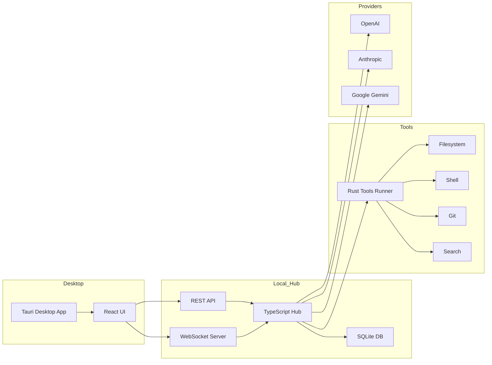

# AI Hub – Full System Architecture

```mermaid
flowchart LR

subgraph Desktop
A[Tauri Desktop App]
B[React UI]
end

subgraph Local_Hub
C[TypeScript Hub]
D[SQLite DB]
E[WebSocket Server]
F[REST API]
end

subgraph Tools
G[Rust Tools Runner]
H[Filesystem]
I[Shell]
J[Git]
K[Search]
end

subgraph Providers
L[OpenAI]
M[Anthropic]
N[Google Gemini]
end

A --> B
B --> F
B --> E

F --> C
E --> C

C --> D
C --> G

G --> H
G --> I
G --> J
G --> K

C --> L
C --> M
C --> N
```
